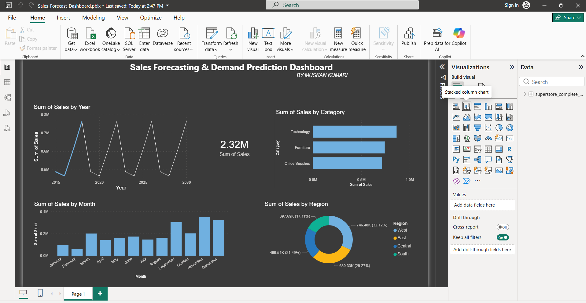

Sales Forecast Dashboard

🎯 Objective: 
Analyze historical sales data and forecast future trends to support business decisions.

🛠️ Tools:
Power BI, Excel

📈 Key Features:
- Sales & profit analysis
- Region & category insights
- 15-day sales forecast
- Interactive dashboard

🔍 Key Insights:
- Sales increase significantly towards the end of the year (Oct–Dec).
- Technology category has the highest sales contribution.
- West region dominates overall sales.
- Forecast shows a steady upward trend.

💡 Recommendations:
- Increase stock before festive months.
- Focus on high-performing regions.
- Improve online payment adoption.
- Optimize low-margin categories.

📷 Dashboard Preview:

